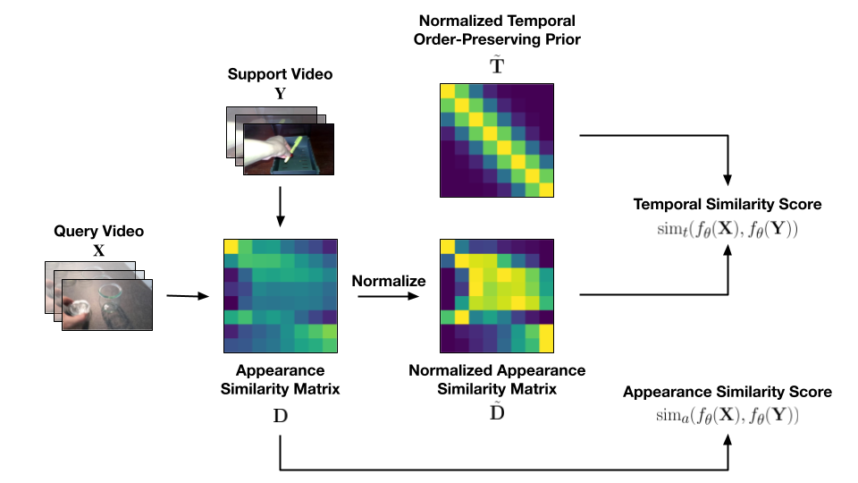

# Inductive and Transductive Few-Shot Video Classification via Appearance and Temporal Alignments
by [Khoi D. Nguyen](https://khoiucd.github.io), [Quoc-Huy Tran](https://cs.adelaide.edu.au/~huy/home.php), [Khoi Nguyen](https://www.khoinguyen.org), [Binh-Son Hua](https://sonhua.github.io), and [Rang Nguyen](https://rangnguyen.github.io)

We present a novel method for few-shot video classification, which performs appearance and temporal alignments. In particular, given a pair of query and support videos, we conduct appearance alignment via frame-level feature matching to achieve the appearance similarity score between the videos, while utilizing temporal order-preserving priors for obtaining the temporal similarity score between the videos. Moreover, we leverage the above appearance and temporal similarity scores in prototypes refinement for both inductive and transductive settings. To the best of our knowledge, our work is the first to explore transductive few-shot video classification.



Details of our evaluation framework and benchmark results can be found in our paper:
```bibtex
@inproceedings{khoi2022ata,
    title={Inductive and Transductive Few-Shot Video Classification via Appearance and Temporal Alignments},
    author={Khoi D. Nguyen and Quoc-Huy Tran and Khoi Nguyen and Binh-Son Hua and Rang Nguyen},
    booktitle={Proceedings of the European Conference on Computer Vision (ECCV)},
    year={2022}
}
```
**Please CITE** our paper when this repository is used to help produce published results or is incorporated into other software.

## Content


- [Prerequisites](#prerequisites)

- [Data Preparation](#data-preparation)

- [Testing](#testing)

- [Training](#training)


## Prerequisites


The code is built with following libraries:


- python 3.6 or higher

- [PyTorch](https://pytorch.org/) 1.0 or higher

- [torchvision](https://github.com/pytorch/vision) 0.2 or higher

- [TensorboardX](https://github.com/lanpa/tensorboardX)

- [tqdm](https://github.com/tqdm/tqdm.git)

- [scikit-learn](https://scikit-learn.org/stable/)

- [opencv-python](https://pypi.org/project/opencv-python/) 4.1 or higher


## Data Preparation

Check [this](https://github.com/MCG-NJU/FSL-Video) for details of data downloading. 

For data preprocessing, we use [vidtools](https://github.com/liu-zhy/vidtools.git) as in [TAM](https://github.com/liu-zhy/temporal-adaptive-module) to extracte frames of video.

The processing of video data can be summarized as follows:

- Extract frames from videos.

  1. Firstly, you need clone [vidtools](https://github.com/liu-zhy/vidtools.git):

     ```bash
     git clone https://github.com/liu-zhy/vidtools.git & cd vidtools
     ```

   2. Extract frames by running:

      ```
      python extract_frames.py VIDEOS_PATH/ \
      -o DATASETS_PATH/frames/ \
      -j 16 --out_ext png
      ```

      We suggest you use ```--out_ext jpg``` with limited disk storage.

- Generate the annotation.

  The annotation usually includes train.txt, val.txt and test.txt (optional). The format of *.txt file is like:

  ```
  frames/video_1 num_frames label_1
  frames/video_2 num_frames label_2
  frames/video_3 num_frames label_3
  ...
  frames/video_N num_frames label_N
  ```

  The pre-processed dataset is organized with the following structure:

  ```
  datasets
    |_ Kinetics400
      |_ frames
      |  |_ [video_0]
      |  |  |_ img_00001.png
      |  |  |_ img_00001.png
      |  |  |_ ...
      |  |_ [video_1]
      |     |_ img_00001.png
      |     |_ img_00002.png
      |     |_ ...
      |_ annotations
         |_ train.txt
         |_ val.txt
         |_ test.txt (optional)
  ```

- Configure the dataset in [ops/dataset_configs.py](ops/dataset_configs.py).

## Testing

The pretrained models are available [here](https://drive.google.com/drive/folders/1vmQOPHAVHbs349U9NRSY2PR8lly7KlTA?usp=sharing)

To test the downloaded pretrained models on Something-Something V2, you can modify/run `scripts/test_somethingv2_rgb_8f.sh`. For example, to test 5-way/1-shot inductive settings on 10,000 episodes:

```bash
# test on Something-Something V2
python -u main.py somethingv2 RGB --arch resnet50 --num_segments 8 -j 2 \
--root_log ./checkpoints/path --root_model ./checkpoints/path --npb \
--resume ./checkpoints/path/ckpt.best.pth.tar --evaluate --gpus 0 --way 5 --shot 1 --episodes 10000
```

**Few-shot Arguments** 

- `episodes`: Number of test episodes, default to `10,000`

- `way`: Number of novel classes, default to `5`

- `shot`: Number of support samples of each novel class, default to `1`

- `n_query`: Number of support samples of each query class, default to `1`

- `iter`: Number of prototype refinement steps for each episode, default to `50`

- `transductive`: Whether to do perform transductive or inductive, default to `False`

## Training


To train on Something-Something V2 from ImageNet pretrained models, you can run `scripts/train_somethingv2_rgb_8f.sh`, which contains:

```bash
# train on Something-Something V2
python -u main.py somethingv2 RGB --arch resnet50 \
--num_segments 8 --gd 20 --lr 0.001 --lr_steps 10 20 --epochs 25 --batch-size 32 \
-j 2 --dropout 0.5 --root_log ./checkpoints/path \
--root_model ./checkpoints/path --eval-freq=1 --npb \
--wd 0.0005 --print-freq 200 --gpus 0 --episodes 600
```

## Acknowledgment
We thank the following repos providing helpful components/functions in our work.
- [FEAT](https://github.com/Sha-Lab/FEAT)
- [TAM](https://github.com/liu-zhy/temporal-adaptive-module)
