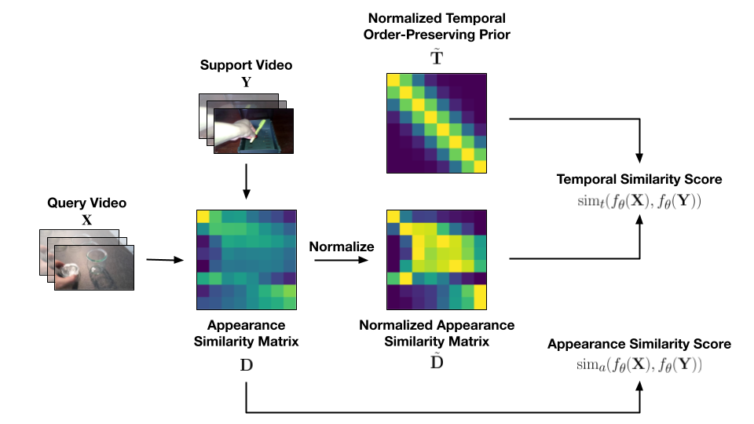

  <h1>Inductive and Transductive Few-Shot Video Classification via Appearance and Temporal Alignments   (ECCV 2022)</h1>

  <h3><a href=https://khoiucd.github.io>Khoi D. Nguyen</a>, <a href=https://cs.adelaide.edu.au/~huy/home.php>Quoc-Huy Tran</a>, <a href=https://www.khoinguyen.org/>Khoi Nguyen</a>, <a href=https://sonhua.github.io/>Binh-Son Hua</a>, <a href=https://rangnguyen.github.io/>Rang Nguyen</a></h3>

The implementation will be released soon.

--------------------

> **Abstract**: 
We present a novel method for few-shot video classification, which performs appearance and temporal alignments. In particular, given a pair of query and support videos, we conduct appearance alignment via frame-level feature matching to achieve the appearance similarity score between the videos, while utilizing temporal order-preserving priors for obtaining the temporal similarity score between the videos. Moreover, we introduce a few-shot video classification framework that leverages the above appearance and temporal similarity scores across multiple steps, namely prototype-based training and testing as well as inductive and transductive prototype refinement. To the best of our knowledge, our work is the first to explore transductive few-shot video classification. Extensive experiments on both Kinetics and Something-Something V2 datasets show that both appearance and temporal alignments are crucial for datasets with temporal order sensitivity such as Something-Something V2. Our approach achieves similar or better results than previous methods on both datasets.

